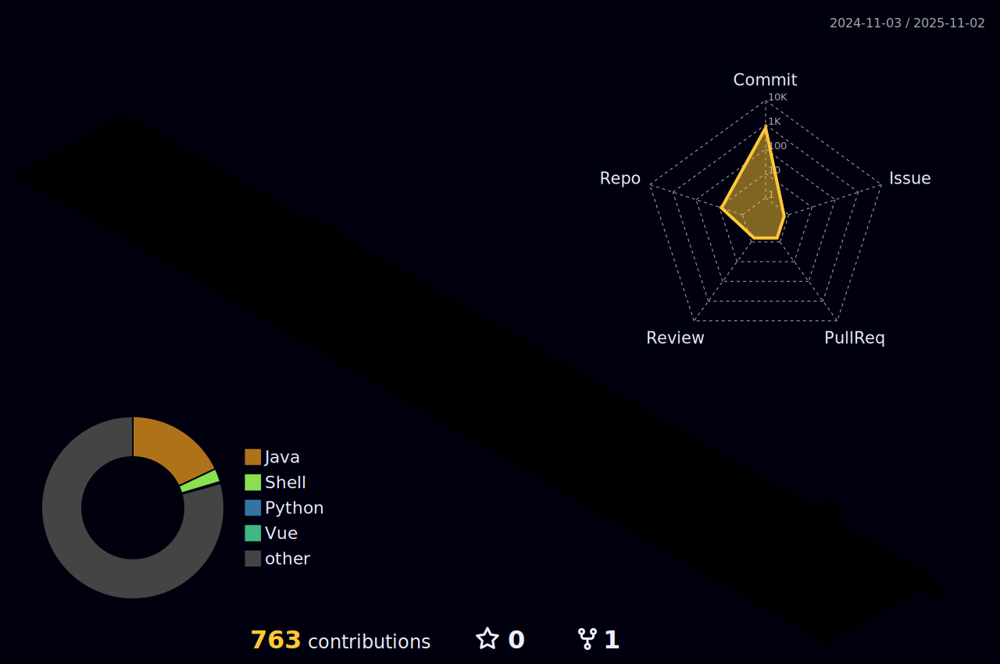

 
    <h2 style="border-bottom: 1px solid #21262d; color: #c9d1d9;"> 안녕하세요 </h2>  
    
 경희대학교 컴퓨터공학부 컴퓨터공학과 졸업 (2018,03 ~ 2024.08)</li> </li>SSAFY 13기 수료 중 (2025.01 ~ ) 
 
    

    

    <h2 style="border-bottom: 1px solid #21262d; color: #c9d1d9;"> 🛠️ Tech Stacks </h2>   
    
 
          
          
          
          
           
          
          
          
          
           

    

    

    <h2 style="border-bottom: 1px solid #21262d; color: #c9d1d9;"> 🧑‍💻 Contact me </h2>   
    

         
          
    
    
  
 
    

    

    <h2 style="border-bottom: 1px solid #21262d; color: #c9d1d9;"> Baekjoon Tier </h2>
    
    

    
 
    <h2 style="border-bottom: 1px solid #21262d; color: #c9d1d9;"> 🏅 Stats </h2> 
   
 

    

